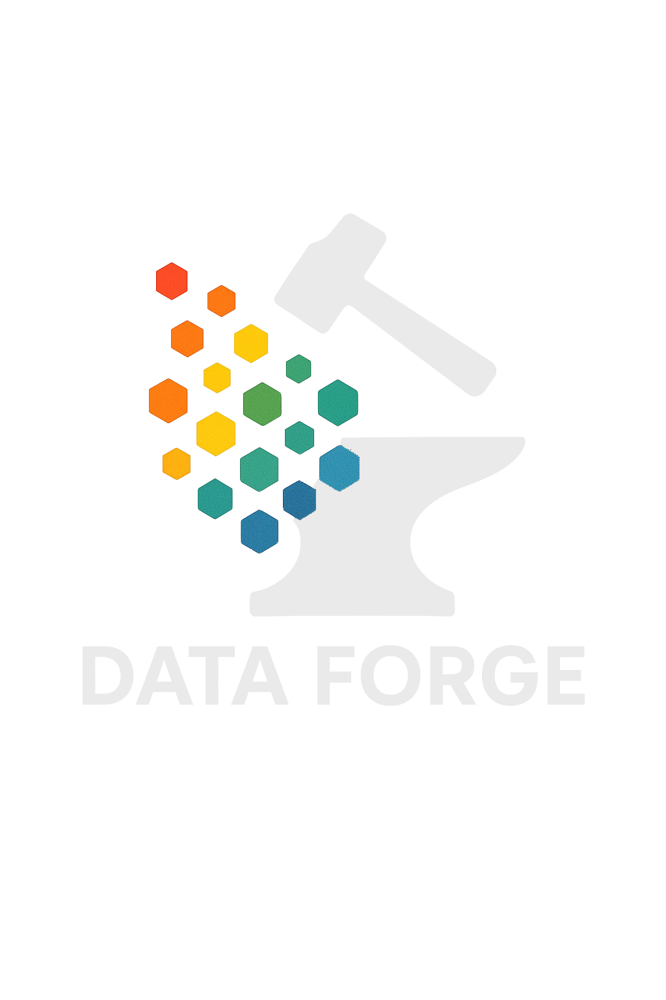

# 🎨 Color Replacer CLI

## 🇫🇷 | Remplacement intelligent de couleurs proches dans les images

Un outil Python en ligne de commande pour **remplacer automatiquement les couleurs proches** dans une image (JPG/PNG), en utilisant une **tolérance perceptuelle DeltaE2000** (colorimétrie Lab).

---

## 🇬🇧 | Smart fuzzy color replacement in images

A simple CLI tool in Python to **automatically replace visually similar colors** in an image (JPG/PNG), using **DeltaE2000 color difference** in Lab color space.

---

## 🧠 Objectif / Purpose

Les images contiennent souvent des **variantes subtiles** d'une couleur (compression, effets, dégradés). Ce script permet de les détecter et de les remplacer automatiquement.

Images often contain **subtle variants** of a color (compression, shading, export artifacts). This script detects and replaces them automatically.

### 🔍 Exemples d'usages / Use Cases
- Harmonisation d’un logo selon une charte graphique  
- Conversion vers un thème sombre ou monochrome  
- Nettoyage d’icônes mal exportées  
- Amélioration du contraste (accessibilité)  
- Traitement batch d’illustrations

---

## 🚀 Installation

### 1. Cloner le dépôt / Clone the repo

```bash
git clone https://github.com/ngenne/swap-colors.git
cd swap-colors
```

### 2. Installer les dépendances / Install dependencies

Utilisation d’un environnement virtuel recommandée / virtualenv recommended.

```bash
pip install -r requirements.txt
```

## 🛠️ Utilisation / Usage

```bash
python src/replace_colors_cli.py input.png output.png --map "#SOURCE:#TARGET" [--map "#SOURCE2:#TARGET2" ...] --tolerance 25
```

## Exemple / Example

```bash
python src/replace_colors_cli.py input.png output.png --map "#121d1b:#cccccc" --tolerance 15
```

> Cela remplacera toutes les couleurs proches de #121d1b par #cccccc, avec une tolérance DeltaE de 15.
> This replaces all colors close to #121d1b with #cccccc, using a DeltaE tolerance of 15.

## ⚙️ Paramètres / Parameters
|	Paramètre	|	Description 🇫🇷	|	Description 🇬🇧	|
|	:---:        	|	    :---:     	|	         :---:	|
|	input.png	|	Chemin de l’image source	|	Path to the input image	|
|	output.png	|	Chemin de l’image de sortie	|	Path to the output image	|
|	--map	|	Paires #source:#cible à remplacer (une ou plusieurs)	|	One or more #source:#target color mappings	|
|	--tolerance	|	Tolérance DeltaE (par défaut : 10.0)	|	DeltaE color tolerance (default: 10.0)	|

## ✅ Avant / Après
| Avant / Before                    | Après / After                    |
| --------------------------------- | -------------------------------- |
|  |  |

## 📝 Licence / License
🇫🇷 Licence propriétaire – usage restreint<br/>
Ce projet est protégé par une licence propriétaire.<br/>
✅ Usage personnel ou éducatif autorisé<br/>
❌ Modification, usage commercial ou redistribution interdits<br/>

Consultez le fichier LICENSE.txt pour plus d’informations.

🇬🇧 Proprietary license – restricted use<br/>
This project is under a proprietary license.<br/>
✅ Personal or educational use allowed<br/>
❌ No modification, commercial use, or redistribution allowed<br/>

See LICENSE.txt for full details.

## 🤝 Contribution
Si vous avez des suggestions, idées d’amélioration ou souhaitez une version avec interface web (ex : Streamlit), n’hésitez pas à me contacter.

Suggestions or improvement ideas welcome – a web version (e.g., Streamlit) please contact me!

📫 Contact : [LinkedIn](https://www.linkedin.com/in/nielsgenne/) ou [Website](https://data-forge.fr/)